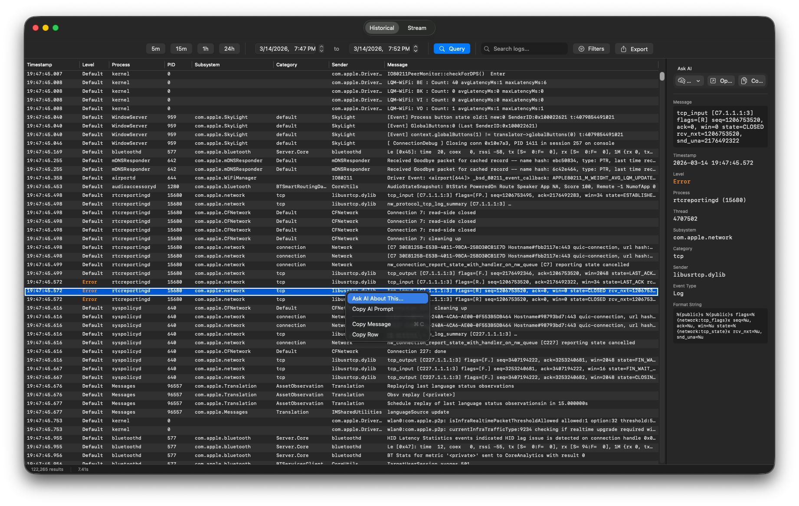
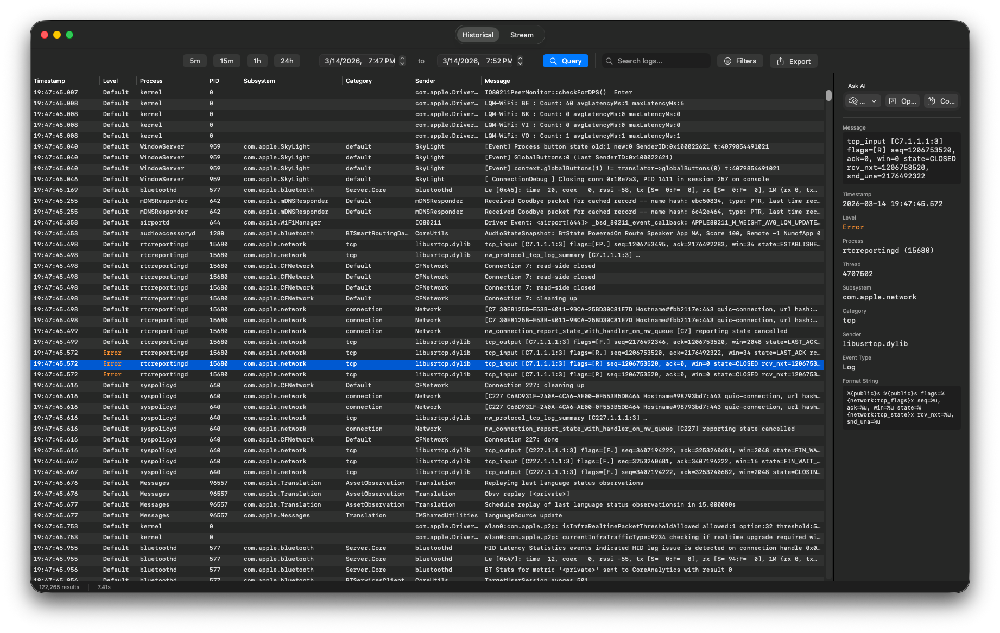
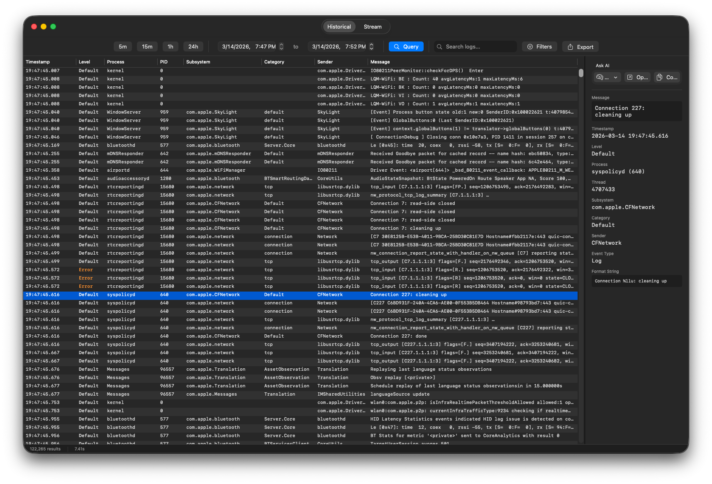

# Logger Utility

A native macOS app for viewing and analyzing unified system logs. Select any log entry, click "Ask AI," and get an instant explanation from Perplexity, ChatGPT, Claude, Gemini, or Copilot — no API keys, no cost. Built with a visual predicate builder, real-time streaming, and an NSTableView that handles 100K+ entries.

### Right-click context menu with Ask AI


### Error entry selected with full detail view


### Historical query with detail inspector


## Features

- **One-click AI lookup** — Right-click any log entry (or select multiple) and send it to Perplexity, ChatGPT, Claude, Gemini, or Copilot. The app builds a contextual prompt with the log message, process, subsystem, macOS version, and more — copies it to your clipboard and opens the browser. No API keys, no accounts, no cost.
- **Real-time log streaming** — Live view of system logs via `log stream` with pause/resume and auto-scroll
- **Historical queries** — Search past logs with arbitrary date ranges and quick shortcuts (5m, 15m, 1h, 24h)
- **Visual predicate builder** — Build complex `log` predicates with a point-and-click UI instead of memorizing syntax (supports ==, !=, CONTAINS, BEGINSWITH, ENDSWITH, LIKE, MATCHES)
- **Advanced filtering** — Filter by process, subsystem, category, sender, and log level
- **High-performance table** — NSTableView handles 100K+ log entries with fixed row heights and cell reuse
- **Log detail inspector** — Side panel showing all fields for the selected entry, with Ask AI and Copy Prompt buttons
- **Export** — Save logs as CSV, plain text, or .logarchive
- **Keyboard shortcuts** — Cmd+K (clear), Cmd+F (search), Cmd+E (export), Cmd+Shift+A (Ask AI)

## Installation

### Download
Download the latest DMG from [Releases](https://github.com/houstontxguy/Logger-Utility/releases) and drag **Logger Utility.app** to your Applications folder.

The app is signed with a Developer ID certificate. On first launch, macOS may prompt you to allow it in **System Settings > Privacy & Security**.

For full log visibility, grant **Full Disk Access** to Logger Utility in **System Settings > Privacy & Security > Full Disk Access**.

### Permissions note

Logger Utility runs `log` commands as the current user. If you are running as a **standard (non-admin) user**, be aware of the following:

- **Some log entries may be hidden** — certain system-level logs are only visible to admin users
- **`.logarchive` export will fail** — `log collect` requires administrator privileges
- **`<private>` redactions** in log messages are controlled at the macOS subsystem level and cannot be removed by any log viewer — see [Removing `<private>` redactions](#removing-private-redactions) below

The app displays warning banners at launch when it detects issues:
- **No Full Disk Access** — banner with an "Open System Settings" button that takes you directly to the Privacy & Security pane
- **Standard user** — banner noting limited visibility and export restrictions

For best results, **run Logger Utility from an admin account** and grant Full Disk Access.

### Removing `<private>` redactions

Many macOS log messages redact sensitive data, showing `<private>` instead of actual values. This is an OS-level privacy feature — no log viewer can bypass it. To reveal this data for troubleshooting, you need to install a configuration profile.

A ready-to-use profile is included in this repo: [`Resources/EnablePrivateLogging.mobileconfig`](Resources/EnablePrivateLogging.mobileconfig)

**To install manually (single Mac):**
1. Download or locate `EnablePrivateLogging.mobileconfig`
2. Double-click the file — macOS will open **System Settings > Privacy & Security > Profiles**
3. Click **Install** and enter your admin password
4. **Restart the Mac** for the change to take effect
5. Log messages will now show actual values instead of `<private>`

**To deploy via MDM:**
Upload the profile to your MDM solution (Jamf, Mosyle, Kandji, etc.) and scope it to the target Macs. No restart prompt is required when deployed via MDM, but a restart is still recommended for full effect.

**To remove:**
Go to **System Settings > Privacy & Security > Profiles**, select "Enable Private Log Data", and click **Remove**. This is a troubleshooting tool — remove it when you're done to restore the default privacy behavior.

### Build from source

```bash
# Clone and build
git clone https://github.com/houstontxguy/Logger-Utility.git
cd Logger-Utility
swift build -c release

# Run tests
swift test

# Build the .app bundle
./Scripts/build-app.sh
```

Or open `Package.swift` in Xcode and press Cmd+R.

## Requirements

- macOS 13 Ventura or later
- Xcode 15+ (to build from source)
- Full Disk Access recommended for complete log visibility

## Architecture

| Layer | Technology |
|-------|-----------|
| UI | SwiftUI + NSTableView (via NSViewRepresentable) |
| Data flow | MVVM + Combine |
| Log access | `Process` shelling out to `/usr/bin/log` with NDJSON parsing |
| Package | Swift Package Manager (no third-party dependencies) |

### How streaming works

1. `LogStreamService` launches `log stream --style ndjson` via `Process`
2. Stdout is read via `FileHandle.readabilityHandler` on a background queue
3. NDJSON lines are parsed with `JSONSerialization` (faster than `JSONDecoder` for flat objects)
4. Entries are batched every 100ms via Combine and published to the UI
5. A `RingBuffer` caps the in-memory store at 100,000 entries

### Project structure

```
Logger Utility/
├── Package.swift
├── Scripts/
│   ├── generate_icon.swift     — Generates AppIcon.icns programmatically
│   └── build-app.sh            — Builds .app bundle and DMG
├── Resources/
│   └── AppIcon.icns            — App icon
├── Sources/LoggerUtility/
│   ├── App/            — Entry point, app state
│   ├── Models/         — LogEntry, LogLevel, LogFilter, PredicateClause, etc.
│   ├── Services/       — LogStreamService, LogShowService, LogParser, ExportService
│   ├── ViewModels/     — StreamViewModel, HistoricalViewModel, FilterViewModel
│   ├── Views/          — SwiftUI views (Stream, Historical, Shared, Components)
│   ├── Utilities/      — RingBuffer, DateFormatting, Constants
│   └── Extensions/     — Color+LogLevel, Process+Async, String+Predicate
├── Tests/LoggerUtilityTests/
└── docs/
    └── design.md
```

## Usage

### Stream tab
1. Click **Start** to begin streaming logs
2. Use the **Search** field to filter visible entries
3. Click **Filters** to open the filter sidebar for subsystem/process/level filtering
4. Click any row to see full details in the inspector panel
5. **Pause** freezes the display while the buffer continues filling

### Historical tab
1. Select a time range using the quick buttons (5m, 15m, 1h, 24h) or the date pickers
2. Click **Query** to fetch logs for that period
3. Results can be searched and filtered the same as the stream tab

### Ask AI
Right-click any log entry and choose **Ask AI About This...** to get help understanding a log message. The app:
1. Builds a contextual prompt including the log message, process, subsystem, macOS version, etc.
2. Copies the prompt to your clipboard
3. Opens your preferred AI tool in the browser (ChatGPT, Claude, Gemini, Perplexity, or Microsoft Copilot)
4. Just paste (Cmd+V) and send

You can also use the **Ask AI** buttons in the detail inspector panel, or press **Cmd+Shift+A**. Your preferred AI provider is remembered between sessions.

### Deep analysis with AI (exported logs)

For deeper investigation of widespread or complex issues, you can export a log covering the time period the problem occurred and send the entire file to an AI service for thorough analysis. Here's the recommended workflow:

1. Use the **Historical** tab to query logs around the time the issue occurred
2. Apply filters to narrow down relevant subsystems/processes if possible
3. **Export** the results as CSV or Plain Text (Cmd+E)
4. Upload the exported file to an AI service like [Claude](https://claude.ai) (recommended — use the Opus model for best results) along with a prompt like:

```
I'm attaching a macOS unified log export from a [describe the Mac — model, macOS version].
The user is experiencing [brief description of the problem].

Please create a thorough analysis including:
- An executive summary at the top before getting into specifics
- What may be causing the problem based on the log entries
- Log snippets with line numbers supporting each theory
- Source all theories with references, preferring official vendor
  documentation (Apple developer docs, support articles, vendor
  knowledge bases) over blogs or forums
- Format the output as a PDF-ready report
```

This approach is especially useful for intermittent issues, kernel panics, networking problems, and MDM enrollment failures where a single log entry doesn't tell the full story.

### Predicate builder
The filter panel includes a visual predicate builder. Add clauses with field/operator/value, choose AND/OR joining, or type a raw predicate string for full control.

## Distribution

This app requires access to system logs and **cannot run in a sandbox**. Distribute via:
- Developer ID signing (notarized for Gatekeeper)
- MDM deployment
- Direct distribution (users must allow in System Settings > Privacy & Security)

## License

MIT
